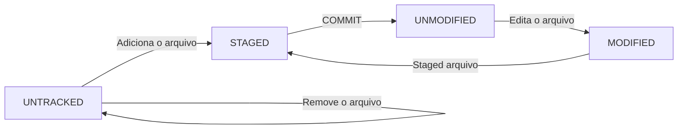

# :books: Estrutura e Comandos Git 

### :computer: Estrutura e Comandos Git



1. **Untracked (Não rastreado)**: Arquivos que existem no seu sistema de arquivos local, mas ainda não foram adicionados ao controle de versão do Git. O Git não tem conhecimento desses arquivos.
2. **Unmodified (Não modificado)**: Arquivos que estão sendo rastreados pelo Git e não foram modificados desde o último commit. O Git está ciente desses arquivos e não há alterações pendentes neles.
3. **Modified (Modificado)**: Arquivos que foram modificados após o último commit. O Git está ciente dessas alterações, mas elas ainda não foram preparadas para um novo commit.
4. **Staged (Preparado)**: Arquivos modificados que foram marcados para serem incluídos no próximo commit. Esses arquivos foram adicionados à área de preparação (staging area) do Git, onde as alterações são organizadas antes do commit.

- Quando você adiciona um arquivo não rastreado ao Git, ele passa de "Untracked" para "Staged".
- Ao editar um arquivo que já está sendo rastreado, ele passa de "Unmodified" para "Modified".
- Quando você executa o comando `git add` em um arquivo modificado, ele passa de "Modified" para "Staged".
- Ao executar o comando `git commit`, os arquivos que estão "Staged" são incluídos no novo commit e voltam para o estado de "Unmodified".

### Comandos:

**`cd "nome pasta"`** - Acessa pasta no diretório.

**`cd ..`** - Retorna um nível no diretório.

**`dir ou ls`** - Lista arquivos dentro da pasta.

**`ls -s ou ls -all`** - Lista todos os arquivos no diretório atual, incluindo arquivos ocultos.

**`crtl+l ou clear`** - Limpa o terminal.

**`mkdir "nome"`** - Cria pasta.

**`mv "nome_antigo" "novo_nome"`** - Altera o nome de arquivos ou pastas pelo terminal.

**`mv "nome arquivo" /"diretório destino"`** - Além de alterar o nome, também pode mover o arquivo ou pasta de local.

**`rm -r 'nome'`** - Remove recursivamente uma pasta existente, ou seja, ele irá percorrer recursivamente a estrutura de pastas a partir da pasta especificada e remover todos os arquivos e subpastas dentro dela. Utilize somente se tiver certeza, não tem volta.

**`touch "nome.extensão"`**- Cria um arquivo vazio com a extensão determinada. Exemplos:

```bash
touch .gitignore   # Cria um arquivo vazio chamado .gitignore
touch README.md    # Cria um arquivo vazio chamado README.md
touch texto1.txt   # Cria um arquivo vazio chamado texto1.txt
```

**`echo [texto]`** - Imprime o texto especificado na tela. Pode ser usado para imprimir o valor de variáveis de ambiente, redirecionar a saída para um arquivo ou criar arquivos com conteúdo específico. Exemplos:

```bash
echo "Olá, mundo!"          # Imprime o texto "Olá, mundo!" na tela
echo $HOME                  # Imprime o valor da variável de ambiente HOME na tela
echo "texto" > arquivo.txt  # Cria um arquivo chamado arquivo.txt contendo o texto "texto"
echo "mais texto" >> arquivo.txt  # Anexa o texto "mais texto" ao final do arquivo arquivo.txt
```

**`cat`** - O comando `cat` é uma abreviação de “concatenate” e é usado para exibir o conteúdo de um ou mais arquivos de texto no terminal. Por exemplo, para ver o conteúdo de um arquivo chamado “arquivo.txt” rastreado pelo Git, você pode usar o comando `cat arquivo.txt`. Para exibir o conteúdo do arquivo “config” localizado dentro da pasta `.git`, você pode usar o comando:

```bash
cat .git/config
```

**`git init`** - No o diretório raiz do projeto será criado um repositório local.

**`git status`** - Verifica o status dos arquivos em um repositório Git. Mostra quais arquivos foram modificados, quais estão prontos para serem commitados e quaisquer outras alterações no repositório. O Git não rastreia pastas vazias, então elas não aparecerão ao executar o comando `git status`.

**`.gitkeep`** - Como o Git não rastreia pastas vazias, às vezes é necessário criar um arquivo vazio dentro de uma pasta vazia para forçar o Git a rastreá-la. É comum usar o nome de arquivo `.gitkeep` para esse propósito, embora qualquer nome de arquivo possa ser usado.

**`git add "nome do arquivo ou pasta"`** - Move um arquivo ou pasta específico do “Untracked” para “Staged”.

**`git add .`** - Move todo o conteúdo da pasta de uma vez do “Untracked” para “Staged”.

**`git commit -m "título explicativo"`** - Adiciona os arquivos que estão no “Staged” no repositório local.

**`git remote add origin "url_repositório"`** - Adiciona a URL ou SSH do repositório remoto ao repositório local.

**`git remote -v`** - Verifica os repositórios que estão configurados (local e remoto).

**`git push -u origin main`** - Envia os arquivos constantes no repositório local “main” para o repositório remoto.

**`git pull origin main`** - Busca para o diretório local todos os arquivos do diretório remoto.

**`git clone "URL"`** - Clona para o repositório local os arquivos de uma URL do repositório remoto.

**`git clone "URL" "nome"`** - Desta forma você realiza um clone, porém define o nome da pasta em seu repositório local.

**`git remote remove origin`** - Remove o repositório remoto.

**`git rm -r --cached "nome arquivo ou pasta"`** - Remove um arquivo ou pasta do repositório local. Adicione o arquivo ao `.gitignore` para que ele não seja enviado novamente.

**`.gitignore`** - Cria um arquivo de texto padrão `.gitignore` (sem extensão). Edite o arquivo adicionando o que deve ser ignorado, um item por linha. Exemplo:

```bash
__init__.py/   # Com a '/' ignora a pasta e todo o seu conteúdo.
venv/          # Ignora a pasta venv e todo o seu conteúdo.
texto.txt      # Ignora o arquivo específico chamado texto.txt.
```

Esta é uma prática recomendada utilizar o arquivo `.gitignore` para evitar que arquivos e pastas desnecessários sejam incluídos nos commits e enviados para o repositório remoto. Isso ajuda a manter o controle de versão limpo e evita que arquivos confidenciais ou gerados automaticamente sejam compartilhados no repositório.

**`git log`** - Visualiza o histórico de commits.

**`git diff`** - Mostra as diferenças entre o estado atual do repositório e o último commit. Isso pode ser útil para ver quais alterações foram feitas antes de prepará-las para um novo commit.

**`git branch`** - Lista todas as branches (ramificações) do repositório local. Isso pode ser útil para ver quais branches existem e em qual branch você está atualmente.

**`git checkout [branch]`** - Muda para a branch especificada. Isso pode ser útil para alternar entre diferentes branches do repositório.

**`git merge [branch]`** - Mescla as alterações da branch especificada na branch atual. Isso pode ser útil para combinar o trabalho feito em diferentes branches.

**`git config --global core.quotepath off`** -  FGit exibirá corretamente os nomes de arquivos com caracteres não-ASCII, desde que o terminal utilizado suporte a codificação UTF-8. Caso seja necessário reverter esse comando, basta alterar `off` para `on` executando o comando `git config --global core.quotepath on`. Isso fará com que o Git volte a usar a representação em octal para exibir caracteres não-ASCII nos nomes de arquivos quando você executar comandos como `git status`.
