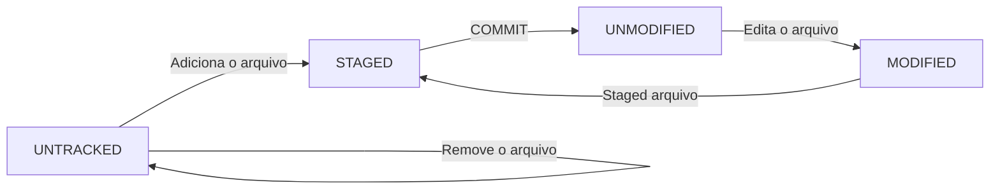

# :books: Salvando Alterações no Repositório Local

Caso precise consultar os comandos básicos do Git, clique [aqui](./5%20-%20Estrutura%20Git%20-%20Comandos%20Básicos.md)

**Status dos arquivos**

Você pode consultar o status do seu repositório local e seus arquivos através do comando:

```bash
git status
```

Através deste comando você poderá ver em qual área do Git os seus arquivos estão localizados.

Para entender melhor, é importante conhecer o “ciclo de vida” de um arquivo no Git. Existem quatro estados principais em que um arquivo pode estar:

1. **UNTRACKED**: O arquivo ainda não foi adicionado ao repositório local. O Git não tem conhecimento da existência do arquivo.
2. **STAGED**: O arquivo foi adicionado ao repositório local, mas ainda não foi salvo em um commit. Ele está pronto para ser incluído no próximo commit.
3. **UNMODIFIED**: O arquivo está no repositório local e não foi modificado desde o último commit.
4. **MODIFIED**: O arquivo foi modificado desde o último commit, mas ainda não foi adicionado ao repositório local (staged).

O ciclo de vida de um arquivo no Git pode ser representado da seguinte maneira:



Quando você cria um novo arquivo, ele começa como UNTRACKED. Quando você adiciona o arquivo ao repositório local usando o comando `git add`, ele passa para o estado STAGED. Quando você salva as alterações em um commit usando o comando `git commit`, o arquivo passa para o estado UNMODIFIED.

Se você editar um arquivo que está no estado UNMODIFIED, ele passará para o estado MODIFIED. Se você adicionar o arquivo ao repositório local novamente usando o comando `git add`, ele passará para o estado STAGED.

Nos próximos passos você entenderá na prática como é simples este ciclo. 

**Criando um Arquivo e Acompanhando seu Ciclo no Git**

Neste guia, você aprenderá a criar um novo repositório local e a acompanhar o ciclo de vida de um arquivo no Git. Vamos criar um arquivo chamado README.md, que é um arquivo Markdown usado para fornecer informações sobre o repositório. Este arquivo será rastreado pelo Git para que possamos observar como ele se move pelo processo de versionamento.

1. Dentro da pasta do repositório, você pode criar um arquivo utilizando o seguinte comando:

   ```bash
   touch README.md
   ```

   - O comando `touch` é usado para criar um novo arquivo.
   - `README.md` é o nome do arquivo, e a extensão `.md` indica que é um arquivo Markdown.

   Existem várias ferramentas para criar arquivos Markdown, como o aplicativo pago Typora, ou a [Versão Gratuita Online](https://readme.so/pt).

2. **Verificando o Status do Arquivo com `git status`**

Ao executar o comando `git status`, você verá algo como:

```bash
Untracked files:
  (use "git add <file>..." to include in what will be committed)
        README.md
```

O arquivo README.md foi identificado pelo Git, mas está "Não Rastreado", ou seja, ainda não faz parte do ciclo do Git e é classificado como `Untracked`.

3. **Adicionando o Arquivo ao Git (STAGED)**

Para rastrear o arquivo, você usará o comando `git add`. Existem diferentes formas de fazer isso:

```bash
git add README.md  # Este comando adiciona um arquivo específico à área STAGED do Git.

git add .  # Usando "git add .", todos os arquivos não rastreados serão movidos para a área STAGED. Certifique-se de que deseja adicionar todos os arquivos.
```

Agora, o arquivo README.md está na área STAGED e pronto para ser commitado.

```bash
Changes to be committed:
  (use "git rm --cached <file>..." to unstage)
        new file:   README.md
```

Se você fizer alterações no arquivo após movê-lo para a área STAGED, ele passará para o estado MODIFIED. Nesse caso, você precisará usar `git add` novamente para mover o arquivo de volta para a área STAGED.

```bash
Changes to be committed:  # Primeira versão do arquivo na área STAGED.
  (use "git rm --cached <file>..." to unstage)
        new file:   README.md
  
Changes not staged for commit:  # Versão modificada na área MODIFIED. Pode ser substituída pela primeira versão usando git add.
  (use "git add <file>..." to update what will be committed)
  (use "git restore <file>..." to discard changes in working directory)
        modified:   README.md
```

4. **Primeiro Commit**

Realizar um commit é o mesmo que dizer "Tenho um ou mais arquivos que estão prontos no meu repositório local e podem ser enviados para o meu repositório remoto."

Neste exemplo o arquivo README.md que está adicionado na área STAGED passará pelo seu último ciclo no Git antes do envio e será modificado pelo comando `git commit` ficando pronto para envio ao repositório remoto.

```bash
git commit -m "Primeiro Commit"
```

Comando commit seguido pelo "-m" significa que você adicionará uma mensagem que deve estar entre aspas sendo uma breve descrição sobre o que você está commitando. Como exemplo, uma informação por erro de digitação no arquivo README.MD foi realizada e ele deverá ser adicionando novamente, commitado para posterior envio. Faça uma alteração no arquivo e siga os comando abaixo:

```bash
git add README.md
git commit -m "Alteração por erro de digitação"
```

5. **Verificando LOG de Commits**

   Passos até aqui:

   * Criação de um novo reposiório.
   * Criação de um arquivo README.md.
   * Adição deste arquivo a área STAGED do Git.
   * Execução do "Primeiro Commit" 
   * Alteração do arquivo README.MD.
   * Nova adição do arquivo para área STAGED.
   * Segundo Commit como "Alteração por erro de digitação".

   Para ver o que está pendente de envio para o repositório remoto basta realizar o comando:

   ```bash
   git log
   ```

   O terminal apresentará em ordem os commits realizados.

   ```
   commit 941594438e557c6750a246a0904a4226fdcb0b92 (HEAD -> main)
   Author: Autor <email@gmail.com>
   Date:   Mon Aug 14 19:09:57 2023 -0300
       Correção de erro de digitação
   
   commit 9fcc7f0ff6a4a8735bb476347943766a1c9e69f9
   Author: Autor <email@gmail.com>
   Date:   Mon Aug 14 18:58:07 2023 -0300
       Primeiro Commit
   ```

   O que significam essas informações: 

   ```bash
   commit 941594438e557c6750a246a0904a4226fdcb0b92 (HEAD -> main)
   Author: Autor <email@gmail.com>
   Date:   Mon Aug 14 19:09:57 2023 -0300
       Correção de erro de digitação
   ```

   * `Commit` - Informa que foi um commit.

   * `941594438e557c6750a246a0904a4226fdcb0b92 ` - "hash" ou "SHA-1 hash" de um commit no Git. O Git usa uma função de hash criptográfica chamada SHA-1 (Secure Hash Algorithm 1) para calcular esse valor exclusivo para cada commit.

   * `HEAD -> main` - O `HEAD` é um ponteiro especial no Git que sempre aponta para o commit mais recente da sua branch atual. Portanto, `HEAD -> main` significa que o HEAD está atualmente apontando para o commit mais recente da branch `main`.
   * `Author` - Responsável pelo commit.
   * `Date` - Data da realização do commit.
   * `Correção de erro de digitação` - Mensagem referenciando o motivo do commit.

6. **Diretório vazio no Git**

   Supondo que seu projeto precisa enviar um diretório que inicialmente está vazio para o repositório local e posteriormente remoto. Dentro do seu repositório crie um diretório com o seguinte nome "dir_vazio" (pode ser qualquer nome).

   ```bash
   mkdir dir_vazio
   ```

   Consulte a situação deste diretório no Git através do `git status`.
   ```bash
   $ git status
   On branch main
   nothing to commit, working tree clean
   ```

   O Git informará que sua `branch main` está limpa e nada para ser commitado. O motivo é que o Git não realiza o rastreamento de pasta vazia. Portanto se seu projeto necessita que exista uma pasta "vazia" por convenção é criado dentro dela um arquivo oculto `.gitkeep`. O arquivo que tem um "." como precedente de seu nome é considerado oculto.

   Este arquivo poderá ser criado através de bloco de notas por exemplo ou até mesmo no terminal Git. No terminal dentro da pasta vazia digite:

   ```bash
   touch .gitkeep
   ```

   Basta consultar novamente através do `git status` e o diretório "dir_vazio" está rastreado e pronto para ser adicionado.

7. **Ignorar o envio de arquivos ou pastas**

   O Git permite que arquivos ou pastas que estejam dentro do seu repositório local não sejam rastreados pelo Git e com isso não sejam apresentados ao consultar pelo `git status`. Desta forma permanecerão somente no repositório local por estarem sendo ignorados pelo Git.

   Para ignorar um arquivo ou pasta é necessário criar um arquivo `.gitignore` seja por algum programa ou pelo terminal do Git.

   A pasta criada anteriormente "dir_vazio" será incluída no arquivo `.gitignore`.

   ```bash
   echo dir_vazio/ > .gitignore
   ```

   * `echo` - Comando para criar um arquivo
   * `dir_vazio/` - Informação que será incluída no arquivo que será criado.
   * `>` - Informo onde a informação acima será incluída.
   * `.gitignore` - Cria o arquivo `.gitignore`.

   Ao consultar o arquivo `.gitignore` pelo terminal (`cat .gitignore`) ou por outro programa a informação no corpo do arquivo será:

   ```bash
   dir_vazio/
   ```

   Veja que ao consultar através do `git status` a pasta "dir_vazio", mesmo tendo o arquivo `.gitkeep` será ignorada pelo Git. Ou seja, o que estiver informado no `.gitignore` seja um arquivo específico ou uma pasta será ignorada.

   Como especificar o que deve ser ignorado:

   ``` bash
   dir_vazio/  # Nome do diretório seguido de / - O diretório e todo seu conteúdo será ignorado.
   teste.txt  # Supondo que existe um arquivo de texto com o nome "teste.txt" basta informar o nome e ele será ignorado. Atenção caso contenham arquivos com o mesmo nome e em diretírios diferentes também serão ignorados.
   dir_teste/teste1.txt  # Desta forma o arquivo teste1.txt que está no diretório dir_teste será ignorado.
   ```

   Supondo a seguinte estrautura:

   ```mermaid
   graph TD
     sub1[dir_teste]
     sub2[teste1.txt]
     sub3[teste2.txt]
     sub4[teste3.txt]
     
   
     
     sub1 -->|Contém| sub2
     sub1 -->|Contém| sub3
     sub1 -->|Contém| sub4
   
   ```

   Diretório: `dir_teste` que contém 3 arquivos sendo  `teste1.txt`,  `teste2.txt`,  `teste3.txt`.

   No `.gitignore` foi incluído especificamente `dir_teste/teste1.txt`, portanto o arquivo `teste1.txt` será ignorado somente neste diretório. Os demais estarão em `untracked` .

   Ao executar o comando `git status` ele apresentará somente o diretório como `untracked`, porém todo o seu conteúdo que tiver sido modificado ou não configurado para ser ignorado ao realizar o `git add .` será modificado para STAGED.

   ```bash
   $ git status
   On branch main
   Untracked files:
     (use "git add <file>..." to include in what will be committed)
           dir_teste/
   ```

   Alteração dos arquivos UNTRACKED para STAGED. Repare que o arquivo `teste1.txt`, foi devidamente ignorado.
   ```bash
   $ git status
   On branch main
   Changes to be committed:
     (use "git restore --staged <file>..." to unstage)
           new file:   dir_teste/teste2.txt
           new file:   dir_teste/teste3.txt
   ```

   Supondo que esses arquivos não eram para terem sido adicionados em STAGED. Posso remover de forma individual ou coletiva.

   * Individual - Especifico de onde eu quero remover o arquivo `staged` informo o caminho e nome do arquivo `dir_teste\teste2.txt`.

     ```bash
     git restore --staged dir_teste/teste2.txt
     ```

     Apenas o arquivo teste2.txt retornara para o status de UNTRACKED.

     ```bash
     $ git status
     On branch main
     Changes to be committed:
       (use "git restore --staged <file>..." to unstage)
             new file:   dir_teste/teste3.txt
     
     Untracked files:
       (use "git add <file>..." to include in what will be committed)
             dir_teste/teste2.txt
     ```

   * Coletiva - Restauro todos os arquivos que estiverem em STAGED para UNTRACKED.

     ```bash
     git restore --staged .
     
     Resultado:
     
     $ git status
     On branch main
     Untracked files:
       (use "git add <file>..." to include in what will be committed)
             dir_teste/
     ```

     Desta forma todos os arquivos que não estão ignorados voltaram para o status de UNTRACKED.

8. **Consultado arquivos que de um diretório UNTRACKED**

   No exemplo anterior temos o arquivo `teste1.txt` ignorado e `teste2. txt` e `teste3.txt`. Você pode executar os seguintes comandos para saber o que tem dentro do diretório `dir_teste`.

   * Lista os arquivos sem distinção que estão no diretório.

     ```bash
     git ls-files --others dir_teste/
     
     Resultado:
     
     $ git ls-files --others dir_teste/
     dir_teste/teste1.txt
     dir_teste/teste2.txt
     dir_teste/teste3.txt
     ```

   * Lista os arquivos sem mostra o que foi ignorado.

     ```bash
     git ls-files --others --exclude-standard dir_teste/
     
     Resultado:
     
     $ git ls-files --others --exclude-standard dir_teste/
     dir_teste/teste2.txt
     dir_teste/teste3.txt
     ```