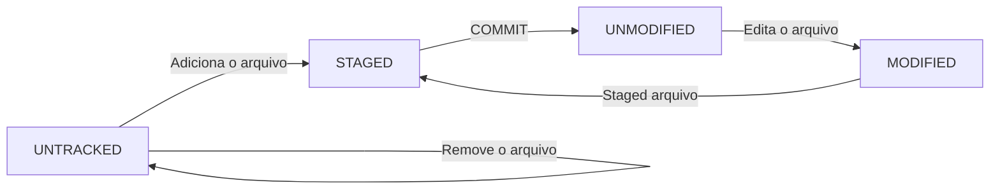

# :books: Aula 2 - Salvando Alterações no Repositório Local

Caso precise consultar os comandos básicos do Git, clique  [aqui](https://github.com/Gerebabh/Git_GitHub_Curso_DIO/blob/64f89376616ddaf8e9c9a244bb4b806c81d33d89/Aula%200%20-%20Estrutura%20Git%20-%20Comandos%20B%C3%A1sicos.md).

### :computer: Temas da aula

- Status dos arquivos.
- Criação de arquivos.
- Criação do arquivo README.md
- Ciclo do arquivo no Git.

Copiar

- Criação de arquivos em Mark Down - [Versão Gratuita Online](https://readme.so/pt).
- Utilização do `echo` para criação de arquivos como exemplo o `.gitignore`.
- Utilização `git add`, `git commit`, `git log`.