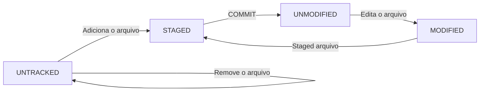

# :books: Aula 2 - Salvando Alterações no Repositório Local

Caso precise consultar os comandos básicos do Git, clique [aqui](./Aula%201%20-%20Criando%20e%20Clonando%20Reposit%C3%B3rios.md).

### :computer: Temas da aula

- Status dos arquivos.
- Criação de arquivos.
- Criação do arquivo README.md
- Ciclo do arquivo no Git.

Copiar

- Criação de arquivos em Mark Down - [Versão Gratuita Online](https://readme.so/pt).
- Utilização do `echo` para criação de arquivos como exemplo o `.gitignore`.
- Utilização `git add`, `git commit`, `git log`.